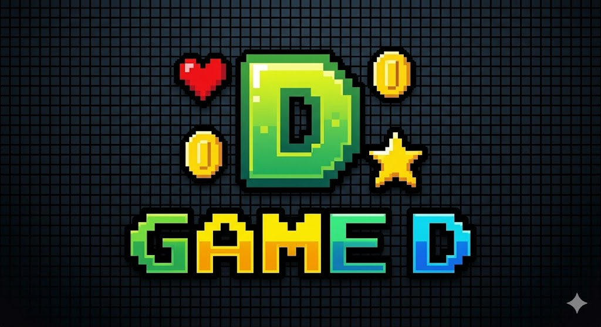

# 🕹️ GAME D | Plataforma de Jogos Online Retrô

<div align="center">
  
  <p><em>"Insert Coin to Start the Experience"</em></p>
</div>

---

## 🎓 Contexto Acadêmico

Este projeto consiste em um trabalho prático desenvolvido pelo **Grupo D** como parte dos requisitos de avaliação da **Pós-Graduação em Cibersegurança** da **Universidade Federal do Pará (UFPA)**.

O objetivo do projeto é demonstrar a construção de uma plataforma web interativa (*Single Page Application*), inspirada no modelo de catálogo de streaming do projeto *Avantiflix*, com foco em estética retrô e técnicas de desenvolvimento web seguro (segurança no lado do cliente).

---

## 🛸 Sobre o GAME D

O **GAME D** é uma plataforma digital projetada sob a estética *Synthwave / Cyberpunk* dos anos 80 e 90, oferecendo serviços de jogos clássicos de fliperama diretamente no navegador. Utilizando renderização vetorial no cliente e síntese de áudio nativa, a plataforma emula a experiência autêntica de gabinetes de fliperama físicos com suporte a controles em tempo real.

### Principais Características:
*   **Visual CRT Emulado**: Filtro CSS customizado que recria o efeito de monitor de tubo, linhas de varredura (*scanlines*) e leve oscilação de brilho.
*   **Cabine de Arcade Virtual**: Interface física interativa na tela com joystick e botões que respondem visualmente aos comandos do teclado.
*   **Áudio Chiptune Sintetizado**: Geração de efeitos sonoros nostálgicos sob demanda por meio de osciladores de áudio nativos do navegador.
*   **Catálogo de Jogos 100% Funcionais**:
    1.  *Space Invaders* (Defesa orbital e destruição de bunkers).
    2.  *Retro Blocks* (Engine geométrica inspirada em Tetris).
    3.  *Neon Snake* (Clássico jogo da cobra redesenhado com estética de neon).

---

## 🛠️ Stack Tecnológica (Specs)

A arquitetura do sistema foi desenvolvida **sem dependências externas de frameworks pesados**, priorizando o desempenho bruto e a redução da superfície de ataque a dependências (Cadeia de Suprimentos / *Supply Chain*):

*   **Estrutura**: HTML5 Semântico.
*   **Estilização**: Vanilla CSS3 estruturado com variáveis customizadas, layouts fluidos (Flexbox/Grid) e animações baseadas em *keyframes*.
*   **Lógica e Motores de Jogo**: Vanilla Javascript (ES6) com laços de renderização baseados em `requestAnimationFrame` para suavidade de quadros (60 FPS).
*   **Interface Gráfica**: Renderização dinâmica via HTML5 Canvas API de forma assíncrona.
*   **Efeitos Sonoros**: Web Audio API (geração de ondas quadradas, dente-de-serra e triangulares dinâmicas).
*   **Persistência**: LocalStorage API para gravação persistente local da tabela de pontuações máximas (*High Scores*).

---

## 🛡️ Aspectos de Cibersegurança Implementados

Como um projeto acadêmico de cibersegurança, foram considerados diversos vetores de vulnerabilidades críticas do ecossistema web para mitigar riscos no lado do cliente:

1.  **Prevenção de Cross-Site Scripting (XSS)**:
    *   Toda entrada de dados do usuário (pesquisa de jogos e nicknames na gravação de recordes) é higienizada de forma estrita.
    *   Injeção de tags HTML nos inputs é neutralizada através do uso de `textContent` em vez de `innerHTML` nas áreas dinâmicas, mitigando riscos de execução de scripts arbitrários (Stored/Reflected XSS).
2.  **Mitigação de Ataques de Supply Chain (Cadeia de Suprimentos)**:
    *   Arquivos CSS e JS são mantidos integralmente locais e sob controle estrito do repositório, minimizando o risco de injeção de scripts maliciosos provenientes de redes de distribuição de terceiros (CDNs comprometidas).
    *   O único recurso externo utilizado (FontAwesome) é carregado via CDN confiável sob requisição estática.
3.  **Sandboxing e Isolamento de Estados**:
    *   O motor de cada jogo é executado dentro do escopo de classes encapsuladas no JavaScript. Variáveis globais de controle de pontuação e estado de memória são isoladas para dificultar a manipulação de scores via console convencional ou ferramentas de script externas.
4.  **Uso Seguro de APIs Locais (LocalStorage)**:
    *   Os recordes são validados estruturalmente (esquema JSON) no momento de leitura do `localStorage` para evitar que a injeção de dados maliciosos no armazenamento local resulte em quebras lógicas ou vulnerabilidades do tipo DOM-based XSS.

---

## 🚀 Como Executar o Projeto

Como o site é uma SPA estática altamente otimizada, nenhuma etapa complexa de build é necessária. Para rodar localmente com suporte completo à Web Audio API (que exige inicialização por protocolo seguro ou localhost devido à segurança dos navegadores):

### Método 1: Servidor Python Integrado
Se você possui o Python instalado, basta executar no terminal na pasta raiz do projeto:
```bash
python -m http.server 9090
```
Acesse no seu navegador: **[http://localhost:9090](http://localhost:9090)**

### Método 2: Servidor Node (Live Server / Http-server)
Se preferir usar o ecossistema Node.js:
```bash
npx http-server -p 9090
```

---

## 🎮 Controles no Teclado

Ao abrir um jogo na cabine e inserir sua ficha virtual, você pode usar os seguintes comandos do teclado:

*   **Movimentação / Direcionais**: `← / A` (Esquerda), `→ / D` (Direita), `↑ / W` (Cima), `↓ / S` (Baixo).
*   **Botão de Ação A**: Tecla `ArrowUp` (Seta Cima) ou `W` ou `R` (Atirar/Rotacionar).
*   **Botão de Ação B**: Barra de Espaço `Space` (Queda Rápida / Pulo).
*   **Botão de Ação C (Start)**: Tecla `Enter` (Iniciar Jogo / Confirmar Iniciais).

---

## 👥 Equipe de Desenvolvimento (Grupo D)

Trabalho desenvolvido pelos discentes da Pós-Graduação em Cibersegurança da UFPA:

*   **Arienilce Sacramento Gonçalves**
*   **Clisciano Nascimento Souza**
*   **Flávio Alexandre Souza Nunes**
*   **Jorgyvan Braga Lima**
*   **Józimo Azevedo Botelho**
*   **Osvaldo José Rodrigues Neves**
*   **Thiago Bitar Cruz**
*   **Wallace Pablo Rocha da Cruz**
*   **Vinícius Antônio de Paula Valente**
*   **Josiane Moraes**

---
<div align="center">
  <p><b>Universidade Federal do Pará</b> | PG em Cibersegurança - 2026</p>
</div>
